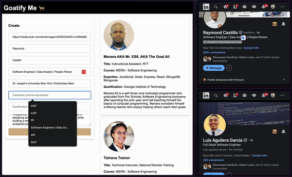

# capstone #

## A web application used for knighting someone as a GOAT ##

server:
- https://capstone-3cku.onrender.com/api
 
 

client:
- https://capstone-frontend-kptw.onrender.com/
 
 

<!--  -->

Trying to understand the basics of react so I aimed to keep this app simple... 
By attempting to use the basic CRUD operations if possible and create a user profile creator / viewer.